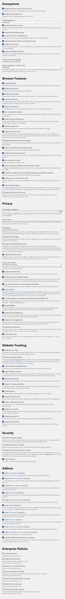

# Better Firefox

## Contents
 - [Description](#description)
 - [Instructions](#instructions)
 - [Standard Preset Details](#standard-preset-details)
 - [Advanced Preset Details](#advanced-preset-details)
 - [Hardcore Preset Details](#hardcore-preset-details)

<br>

## Description

Firefox settings and plugins to improve the security, privacy and user experience of different types of users.  
To target the different user profiles, 3 different presets have been created:
* **Standard**: this preset has been developed with the average user in mind and therefore security and usability are prioritized over privacy (e.g. both Widevine and Google safebrowsing are enabled by default).

* **Advanced**: this preset has been developed with power users in mind, prioritizing usability over privacy (meaning that features like Widevine are enabled by default) but disabling unessential features that track user activity (e.g. Google safebrowsing, malware scan, search suggestions...) since power users do not really need them.

* **Hardcore**: this preset has been developed with the most privacy-concerned users in mind. Beware that the additional privacy layers could lead to usability issues (e.g. WebGL and Widevine based sites might not work to avoid any sort of fingerprinting).

[ffprofile.com](https://ffprofile.com/) has been used to create the basis of this project, so special thanks to its developers.

<br>

## Instructions

First, select whichever preset fits you and your needs the most and download/open its folder. Inside of it is everything one needs to install/apply said preset and, in fact, there are two ways to do so:
* Run **_setup.cmd_** (from the setup folder) as administrator.
* Copy (and replace) the **_extensions_** folder and the **_prefs.js_** file to the following location:
```
%APPDATA%/Mozilla/Firefox/Profiles/<YourProfile>
```

These presets are also compatible with most Firefox forks and Gecko/Goanna browsers.  
They have been tested to work with the following:
* Waterfox
* Icecat
* Basilisk
* Pale Moon
* LibreWolf
* K-Meleon

In order to use a given preset with an untested Gecko/Goanna browser, copy (and replace) the **_extensions_** folder and the **_prefs.js_** file (found inside the preset's folder) to the following location:
```
%APPDATA%/<YourBrowser>/Profiles/<YourProfile>
```

<br>

## Standard Preset Details


<br>

## Advanced Preset Details


<br>

## Hardcore Preset Details

