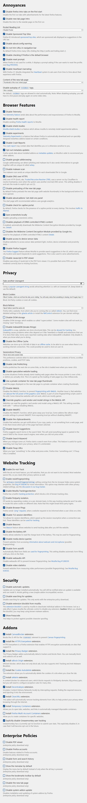

# Standard Preset

Firefox settings and plugins to improve the security, privacy and user experience of most users.  
Despite featuring many privacy tweaks and add-ons, this preset has been developed with the average user in mind and therefore security and usability are prioritized over privacy (e.g. both Widevine and Google safebrowsing are enabled by default).

[ffprofile.com](https://ffprofile.com/) has been used to create the basis of this project, so special thanks to its developers.

## Instructions

There are two ways to apply/install this preset:
* Run **_setup.cmd_** (from the setup folder) as administrator.
* Copy (and replace) the **_extensions_** folder and the **_prefs.js_** file to the following location:
```
%APPDATA%/Mozilla/Firefox/Profiles/<YourProfile>
```

This preset is also compatible with most Firefox forks and Gecko/Goanna browsers.  
It has been tested to work with the following:
* Waterfox
* Icecat
* Basilisk
* Pale Moon
* LibreWolf
* K-Meleon

In order to use this preset with an untested Gecko/Goanna browser, copy (and replace) the **_extensions_** folder and the **_prefs.js_** file to:
```
%APPDATA%/<YourBrowser>/Profiles/<YourProfile>
```

## Details

